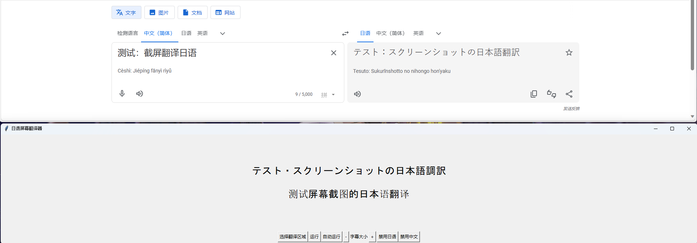

# 介绍
本应用基于Python，用于自动截取电脑屏幕上的图片，用OCR技术识别图片中的日语，并通过神经网络将日语翻译成中文。日语和中文会显示在应用的GUI中。

# 安装
0. 建议使用conda或venv的虚拟环境安装python包
1. 安装Python（此部分可参考其他网站安装）
2. 安装GPU版本的Pytorch：`python -m pip install torch torchvision torchaudio --index-url https://download.pytorch.org/whl/cu118`
3. 安装其他依赖：`python -m pip install -r requirements.txt`

# 运行
0. 第一次运行时会自动下载神经网络算法权重
1. 使用python命令运行：`python main.py`
2. 点击“选择翻译区域”，用鼠标选择翻译区域后，按键盘上的ESC键确定
3. 选择“运行”或“自动运行”，即可运行

